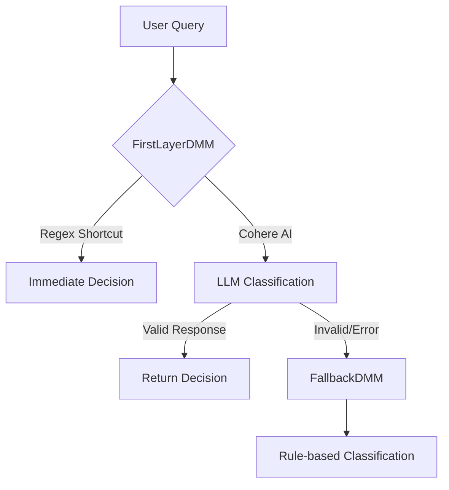
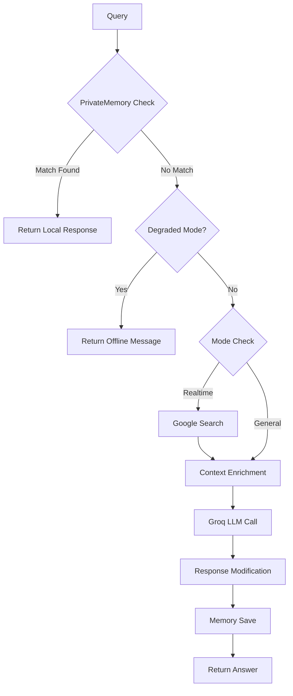
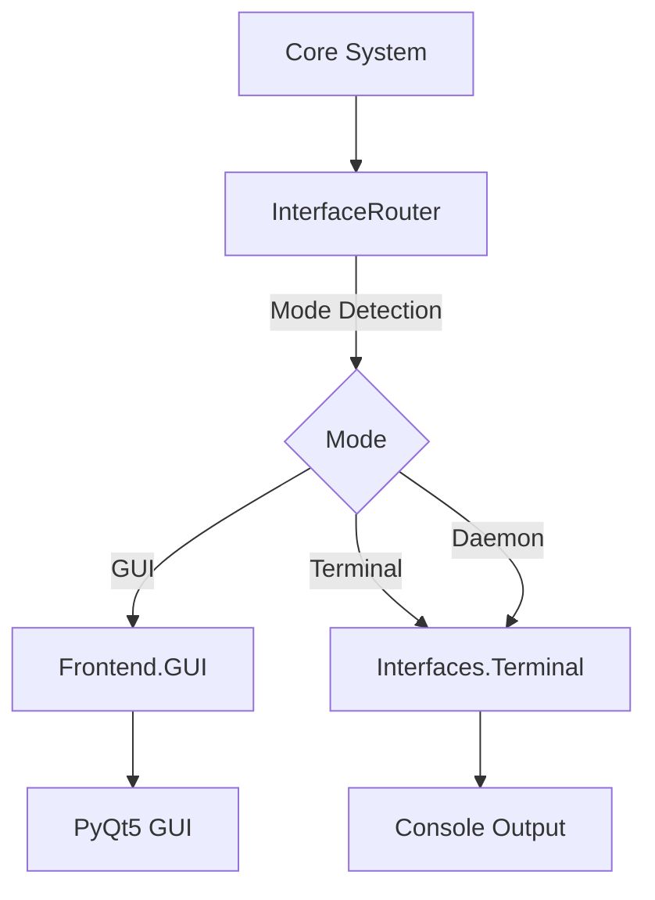
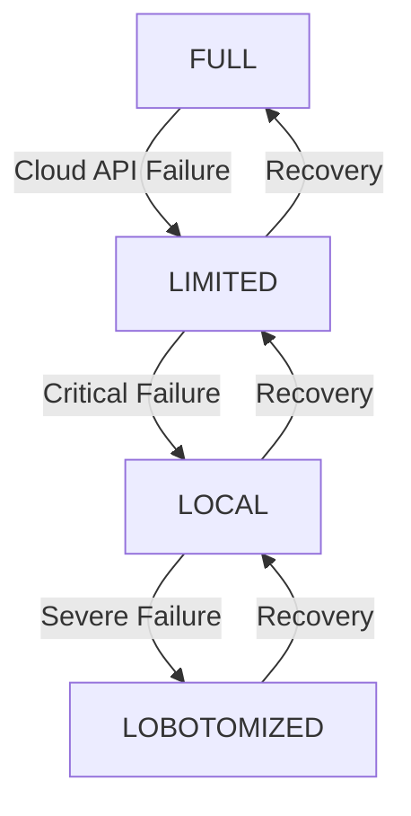
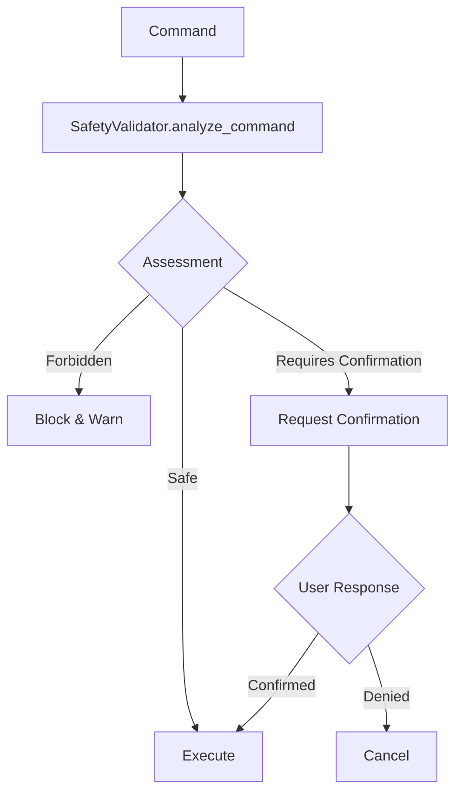
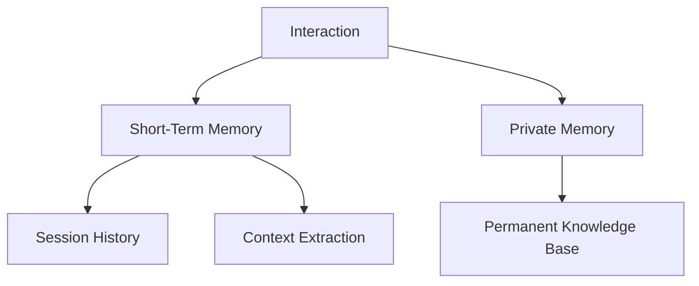

# LEO AI Assistant - Comprehensive Architecture Analysis

## Project Overview

Leo AI is an autonomous, terminal-first, daemon-capable AI assistant designed for high reliability and low resource consumption. It features a robust backend-centric execution model with legacy GUI accessibility preserved through a proxy pattern interface system.

## Core Architecture

### 1. System Design Principles

**Key Characteristics:**
- **Backend-First Architecture**: Core logic resides in `Backend/` directory
- **Interface Agnostic**: Communication via `InterfaceRouter` proxy pattern
- **Degraded Mode Support**: Multiple fallback mechanisms for reliability
- **Phased Startup**: Heavy services initialized in background threads
- **Safety-Centric**: Comprehensive safety validation and confirmation system

### 2. Main Entry Point

**File**: [`Main.py`](Main.py)

**Core Responsibilities:**
- System initialization and configuration
- Main execution loop (`MainExecution`)
- Background service initialization (`BackgroundServiceInitializer`)
- Microphone status monitoring (`FirstThread`)
- Chat log management and GUI integration

**Key Features:**
```
┌─────────────────────────────────────────────────────────────┐
│ Main Execution Flow                                         │
├─────────────────────────────────────────────────────────────┤
│ 1. State & Safety Check                                     │
│ 2. Speech Recognition (if query not provided)               │
│ 3. Query Classification (FirstLayerDMM)                     │
│ 4. Command Validation & Safety Assessment                    │
│ 5. Automation Execution                                     │
│ 6. Response Generation (AnswerEngine)                       │
│ 7. Text-to-Speech Output                                    │
└─────────────────────────────────────────────────────────────┘
```

### 3. Decision Making System

**File**: [`Backend/Model.py`](Backend/Model.py)

**Architecture:**


**Supported Command Types:**
- `general` - Conversational queries
- `realtime` - Current events/news queries
- `weather` / `forecast` - Weather information
- `open` / `close` - Application control
- `play` - Media control
- `system` - System operations (volume, brightness)
- `content` - Content generation and file operations
- `google search` / `youtube search` - Web searches
- `generate image` - Image generation
- `reminder` - Reminder/timer management
- `exit` - System termination

### 4. Answer Generation Engine

**File**: [`Backend/AnswerEngine.py`](Backend/AnswerEngine.py)

**Architecture:**


**Key Features:**
- **Private Memory**: Local identity knowledge base
- **Memory Manager**: Session context retention
- **Search Integration**: Google search for realtime queries
- **Degraded Mode Handling**: Graceful fallback
- **API Retries**: Automatic retry logic for cloud failures

### 5. Interface System

**File**: [`Backend/InterfaceRouter.py`](Backend/InterfaceRouter.py)

**Proxy Pattern Architecture:**


**Contract Functions (Mandatory):**
- `ShowTextToScreen(Text)` - Display text to user
- `SetAsssistantStatus(Status)` - Update assistant status
- `SetMicrophoneStatus(Command)` - Control microphone
- `GetMicrophoneStatus()` - Get microphone state
- `GetAssistantStatus()` - Get assistant status
- `AnswerModifier(Answer)` - Format response for display
- `QueryModifier(Query)` - Standardize user input
- `GraphicalUserInterface()` - Launch main interface

### 6. State & Failure Management

**Files**: [`Backend/StateManager.py`](Backend/StateManager.py), [`Backend/FailureHandler.py`](Backend/FailureHandler.py)

**Degraded Modes:**


**Failure Handling Tiers:**
- **Tier 1**: Transient errors with retries
- **Tier 2**: Degraded mode activation
- **Tier 3**: System shutdown protocols

### 7. Safety System

**File**: [`Backend/Safety.py`](Backend/Safety.py)

**Safety Architecture:**


**Safety Features:**
- Command validation against forbidden actions
- Critical action confirmation requirements
- Warning messages for sensitive operations
- User confirmation via speech recognition

### 8. Automation System

**Files**: [`Backend/Automation.py`](Backend/Automation.py), [`Backend/Actions/`](Backend/Actions/)

**Action Categories:**
- **Web Actions**: Browser control, searches
- **App Actions**: Application launch/close
- **File Actions**: File operations
- **System Actions**: Volume control, brightness

### 9. Audio System

**Files**: [`Backend/TextToSpeech.py`](Backend/TextToSpeech.py), [`Backend/SpeechToText.py`](Backend/SpeechToText.py), [`Backend/Hotword.py`](Backend/Hotword.py)

**Features:**
- Multiple TTS engines (Edge TTS, ElevenLabs, pyttsx3)
- Speech recognition via microphone
- Hotword detection for hands-free operation
- Volume control system

### 10. Memory System

**Files**: [`Backend/Memory.py`](Backend/Memory.py), [`Backend/PrivateMemory.py`](Backend/PrivateMemory.py)

**Architecture:**


## System Requirements

**Dependencies** (from [`Requirements.txt`](Requirements.txt)):
- AI/LLM: `cohere`, `groq`, `langdetect`
- Audio: `elevenlabs`, `edge-tts`, `pyttsx3`, `pygame`
- Web: `googlesearch-python`, `bs4`, `requests`, `selenium`, `webdriver-manager`
- GUI: `PyQt5`
- System: `psutil`, `keyboard`
- Utility: `python-dotenv`, `rich`, `appopener`, `pywhatkit`, `mtranslate`

## Architectural Rules & Constraints

**Frozen Layers (Read-Only):**
- `Frontend/` - GUI implementation (PyQt5)
- Decision Logic Core - Regex-based routing in Main.py

**Living Layers (Active Development):**
- `Backend/` - Core logic and engines
- `Interfaces/` - Terminal and future interface implementations
- `Main.py` - Entry point and lifecycle management

**Strict Rules:**
1. All core-to-interface communication must go through `InterfaceRouter`
2. GUI must not be refactored or modified
3. New UI functionality must be implemented in `Interfaces/` layer
4. Imports should be local scoped where possible for mode-based isolation
5. Changes must be tested in `--terminal` and `--daemon` modes

## Operational Modes

**1. GUI Mode (Default):**
- Full graphical interface
- PyQt5 dependency loaded lazily
- Interactive chat window

**2. Terminal Mode (`--terminal`):**
- Console-only interface
- No GUI dependencies
- PID file management

**3. Daemon Mode (`--daemon`):**
- Background service operation
- Logs to `Data/leo.log`
- Audio disabled by default
- PID file enforcement

## Recent Architectural Improvements

**Hardening Measures:**
1. **Interface Decoupling**: Implementation of `InterfaceRouter` for proxy pattern communication
2. **Lazy Loading**: PyQt5 imported only when GUI mode is explicitly requested
3. **Terminal Interface**: New `Terminal.py` as default headless interface
4. **PID Control**: Process ID management for single instance enforcement
5. **Signal Handling**: Standard SIGINT/SIGTERM handlers for clean shutdown
6. **Phased Startup**: Background thread initialization for heavy services

## Current Stability Status

**ARCHITECTURALLY HARDENED** - System has successfully transitioned to a decoupled interface model with phased startup and hardware initialization.

## Next Development Intent

**Continuous stability and extension of terminal-first capabilities while maintaining GUI-dormancy compatibility.**

Key focus areas:
- Enhanced terminal interface functionality
- Improved daemon mode reliability
- Additional interface type support
- Performance optimization for low-resource environments
